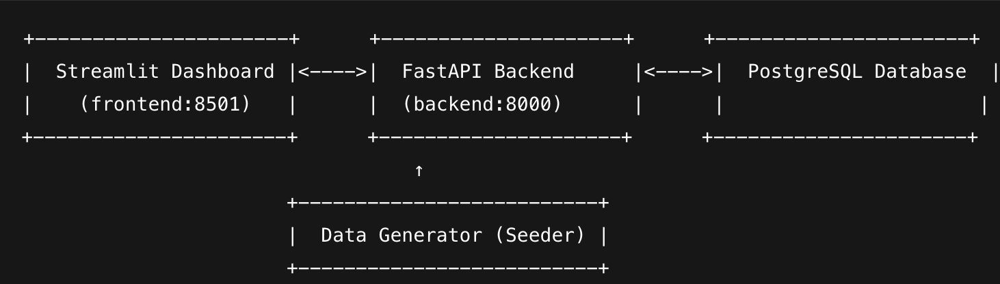

# Maple Leafs Hockey Telemetrics
This system evaluates NHL players (defensemen currently) based on player &amp; puck tracking data using predictive metrics. 

# How to access

After building the Docker containers, access via:

1. Access FE: http://localhost:8501

2. Access BE: http://localhost:8000/docs

## Project Goals
- Analyze defensive effectiveness using real-world and synthetic tracking data

- Compute advanced metrics like Zone Entry Denial Rate, xGA, and Slot Coverage

- Visualize player movements using a simple Streamlit dashboard

- Optionally simulate live games using a synthetic data generator

- Leverage PostgreSQL for relational and time-series data

- Use FastAPI for serving insights and managing simulation

## Architecture



## Metrics used to Evaluate a Defenseman

| Metric                        | Why It’s Valuable                                              | Implementation Plan                                                                 |
|------------------------------|----------------------------------------------------------------|-------------------------------------------------------------------------------------|
| Zone Entry Denial Rate       | Measures ability to prevent attackers entering DZ.             | Detect puck moving toward DZ, check if defenseman blocks/forces turnover before blue line. |
| Defensive Zone Time per Shift| Longer DZ time = more defending, possibly less effective.       | Identify shift windows for each D, then calculate avg time spent in DZ (x < -75 for example). |
| Puck Recovery Rate           | Great D-men regain puck after scrambles.                       | Find frames where puck is loose near defenseman and is recovered by same team.     |
| Slot Coverage Effectiveness  | Protecting the "house" prevents high-danger shots.             | Count time defenseman spends near slot (~ x = ±15, y = ±10) when puck is in DZ.    |
| Shot Block / Deflection Impact | Quantifies risk reduction.                                   | Cross-ref with external NHL shot attempt data (if possible); for now count proximity to puck at time of shot. |
| Transition Kill Rate         | Measures ability to disrupt neutral zone rush.                 | Detect puck movement across neutral zone, check if defenseman impedes path.        |
| xGA While On-Ice (Adj)       | High-level view of impact.                                     | Advanced: Requires estimating expected goals using player + puck positions.        |

# Implement Later
**Defensive Zone Start Percentage (DZS%)**:
The proportion of a player's shifts that begin in their defensive zone.

> **DZS%** = (Defensive Zone Starts) / (Offensive Zone Starts + Neutral Zone Starts + Defensive Zone Starts + On-the-Fly Starts)

Sources:

- https://thewincolumn.ca/2017/08/18/behind-the-bruise-evaluating-the-force-of-a-blocked-shot/

- https://puckplusplus.com/2015/01/15/how-much-do-zone-starts-matter-i-maybe-not-as-much-as-we-thought

- https://smahtscouting.com/2020/06/11/defensemen-roundtable/

- https://novacapsfans.com/2022/07/06/evaluating-the-performance-of-nhl-defensemen-with-goals-above-replacement-gar

## Backend Service

```bash
# Enter the backend container
docker exec -it maple_leafs_backend bash
```
## Database

To freshly seed the data, perform the following:

```bash
docker exec -it maple_leafs_backend python -m app.data_generator.seed_data

```

To examine the database inside the docker container and perform steps 1 by 1, perform the follows

```bash

# Enter the backend container
docker exec -it maple_leafs_backend bash

# Seed the database
python data_generator/seed_data.py

# Enter the database container
docker exec -it maple_leafs_postgres bash

# Enter the DB
psql -U telemetry -d telemetry_db
```

## Interview Questions

| Questions                                                                                                  | Answers                                                                                                                                                                                                                                                                                                                                                   |
|------------------------------------------------------------------------------------------------------------|-----------------------------------------------------------------------------------------------------------------------------------------------------------------------------------------------------------------------------------------------------------------------------------------------------------------------------------------------------------|
| What metrics would you create to help you in your evaluation? Why?                                         | • Defensive Zone Time per Shift – shows time spent under pressure • Slot Coverage Percentage – evaluates positioning in high-danger area • (Planned) Zone Entry Denial Rate – measures effectiveness in stopping zone rushes • (Planned) xGA – expected goals against while on ice • Metrics chosen to reflect positioning, pressure handling, and impact |
| Describe, at a high level, the process(es) you will use to transform the raw data into your new metric(s). | • Generate or ingest player/puck tracking data (x, y, timestamp, etc.) • Define spatial zones like slot, DZ, etc.                                                                                                                                                                                                                                         |
| What kinds of unexpected errors might you run into over the course of a season?                            | • Data spikes (e.g., bad  x/y coordinates) • Puck and player timestamp mismatches  • Game format changes (e.g., overtime, 3v3) affecting assumptions                                                                                                                                                                                                      |
| How would you make sure your processing code is time- and memory-efficient?                                | • Heavy use of key/store like redis during games • Archiving of game to compressed archive                                                                                                                                                                                                                                                                |
|                                                                                                            |                                                                                                                                                                                                                                                                                                                                                           |

